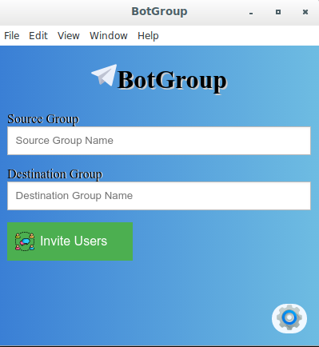
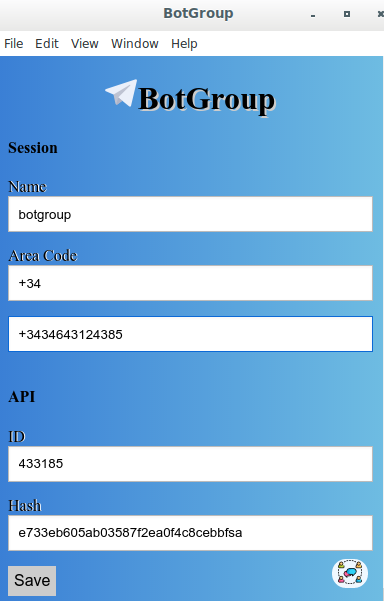

<h1>Telegram App - Invite Users Between Groups</h1>

This application invites users in Telegram from a source to destination group.

Main engine was writen in Python thanks to  and User interface in NodeJS

 

Contact me if you have any questions: <b>rockscripts@gmail.com</b>

<h1>INSTALLING APPLICATION</h1>
<h4>Requirements</h4>

This is a Python and NodeJS application and you need follow things in your operating system:
<ul>
<li>GIT</li>
<li>Python 3</li>
<li>pip3</li>
<li>Nodejs</li>
<li>NPM</li>
</ul>

<h4>Running APP</h4>

Engine Part with Python

<ul>
<li>cd engine</li>
<li>pip3 install Telethon</li>
<li>pip3 install Telethon-sync</li>
<li>pip3 install PySocks</li>
<li>pip3 install peewee</li>
<li>pip3 install colorama</li>
<li>pip3 install pprint</li>
</ul>

GUI part with ElectronJS

<ul>
<li>cd gui</li>
<li>npm install</li>
<li>npm start</li>
</ul>